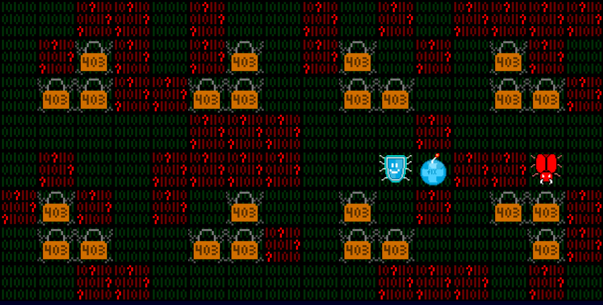

[**Portuguese version // Versão em português**](README_pt-BR.md)

Bug Hunter is an action bomberman-like game where your objective is to find and fix (EXPLODING!) the bugs of your code.

## Gameplay

Use W,A,S,D or the arrow keys to move your character.

Use Spacebar to drop your fix bombs.

You can get power-ups by fixing the messed code parts spread across the map.

Be careful not to get stuck on dead ends and letting the fix explosion reach you, there are some parts of the code where both you and the bugs will have your access denied.

Don't lose all your health points and accumulate your score as you pass through the levels.

### Play the game here: https://henribdev.github.io/Bug-Hunter/

## Development

This game was made using standard HTML, CSS and JavaScript.

Current version - 0.0.2.

Game made by: <b>Henrique Barbosa</b>. LinkedIn - https://www.linkedin.com/in/henribdev/ GitHub - https://github.com/HenriBDev/

